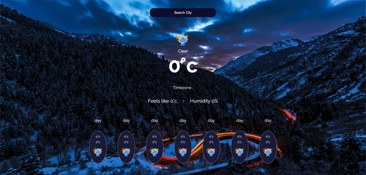

# Ok-weather-app-js

Ok-weather-app uses the https://openweathermap.org/api/one-call-api#data API for its data, this data is a One-call API, and of course it's free but limited, it provides the Current weather in celcius, Humidity in percentage, Timezone, and Daily forecast for 7 days. It also provides you with interactive displays in icons and background images, great UI and mobile friendly.


## How to use?

query the API through the input field provided with ONLY the city name and if it has a hyphen replace it with an underscore, and hit enter.


## Demo




#### Live link

```
http://ok-weather-app-js.vercel.app/
```


## Stack

<p align="left"> <a href="https://www.w3schools.com/css/" target="_blank">  </a> <a href="https://www.w3.org/html/" target="_blank">  </a> <a href="https://developer.mozilla.org/en-US/docs/Web/JavaScript" target="_blank">  </a></p>


